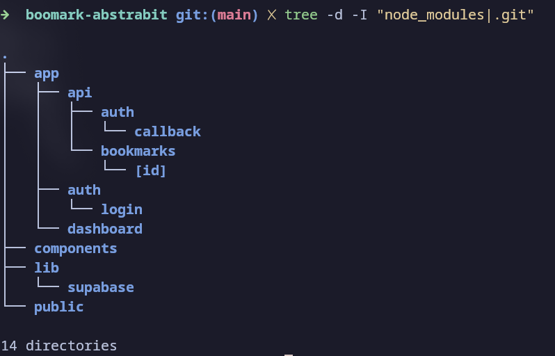
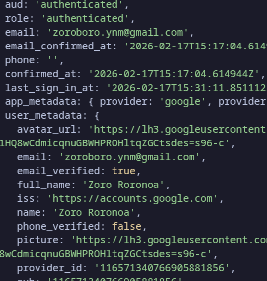
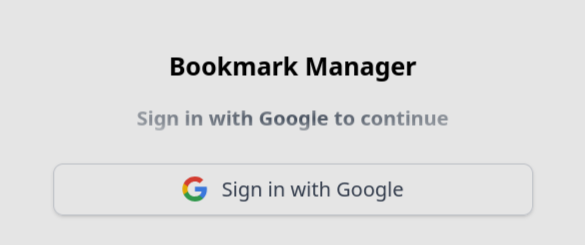

#  Bookmark-Bits App

A real-time bookmark manager built with Next.js, Supabase(Real Time), and Tailwind CSS [extra Google OAuth].

## Features

-  Google OAuth authentication
-  Add bookmarks with URL and title
-  Private bookmarks per user
-  CURD Operations [Supabase PSQL DB]
-  Real-time updates across tabs (Supabase Realtime)

## Setup

1. **Install dependencies:**
   ```bash
   npm install
   ```

3. **Configure environment variables:**
   Create a `.env` file:
   ```
   Follow the env.example
   ```

4. **Run the development server:**
   ```bash
   npm run dev
   ```



### workflow
1. Page.tsx file Checks the Basic Auth whether the user is had cookies in local storage and which matches data with supbase authentication
```
if auth === 1
   /dashboard
else
   /login
   ```

2. Login page Supabase googe provider check the Auth.
Once verified redirects to the Login page.

3. Book Mark Form Consists POST which resides in api/bookmarks/route.ts
```
{
   method:POST,
   headers: {'Content-Type': 'application/json},
   body: JSON.stringfy({url,title})
}
```
4.Creating Supabse channel websocket to listen live updates of INSERT , DELETE , UPDATE.

Initial fectch using APIS and after that  a live websocket listens the operations in supabase and updates the States of Bookmarks!